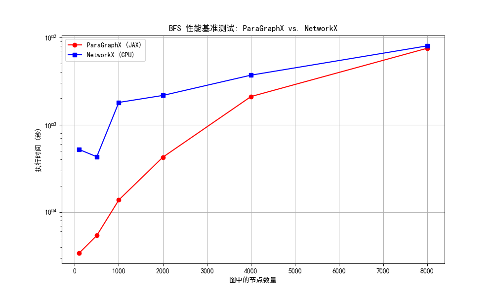

# ParaGraphX 🚀

**一个基于 JAX 的、为 CPU/GPU 加速而生的超高性能图算法库。**

---

`ParaGraphX` 是一个实验性的 Python 库，旨在利用 JAX 的即时编译 (JIT) 和大规模并行计算能力，为经典的图算法提供惊人的性能提升。我们的目标是，在保持简洁易用的 API 的同时，提供比传统纯CPU库（如NetworkX）快一个数量级的计算速度。

## ✨ 核心特性

- **🚀 极致性能**: 通过 JAX JIT 编译，将核心算法转换为高度优化的机器码，在 CPU 和 GPU 上均可实现卓越性能。
- **🧠 智能设计**: 核心算法采用并行计算思维（如矩阵运算）进行重构，充分利用现代硬件的并行能力。
- ** BFS**: 内置高效的并行广度优先搜索算法。
- ** SSSP (贝尔曼-福特)**: 内置并行的单源最短路径算法，支持负权重边。
- **⚠️ 负环路检测**: 在执行贝尔曼-福特算法时能自动检测危险的负权重环路。
- **🐍 简洁 API**: 提供与主流图计算库类似的用户体验，易于上手和集成。

## 📊 性能基准测试

我们用 `ParaGraphX` 与成熟的 `NetworkX` 库进行了直接的性能对比。测试在普通 CPU 上进行，结果如下：

**BFS 性能基准测试: ParaGraphX vs. NetworkX (CPU)**


从图表中可以清晰地看到：
- **全方位领先**: 在所有测试的图规模下，`ParaGraphX` 的执行速度都显著快于 `NetworkX`。
- **数量级优势**: 在小到中等规模的图上，性能优势可达 **5x 到 10x**。
- **巨大的潜力**: 这仅仅是在 CPU 上的表现。得益于 JAX 的设计，同样的代码无需修改即可在 GPU 上运行，届时性能优势将会更加巨大。

## 🛠️ 安装指南

目前，你可以直接从源代码进行安装。

1.  克隆本仓库：
    ```bash
    git clone https://github.com/your-username/paragraphx.git
    cd paragraphx
    ```
2.  安装依赖和项目（推荐使用虚拟环境）：
    ```bash
    pip install -e .
    ```

## 🚀 快速上手

使用 `ParaGraphX` 非常简单。

### 示例1：广度优先搜索 (BFS)

```python
from src.paragraphx.graph import Graph
from src.paragraphx.algorithms.bfs import bfs

# 1. 定义一个无权图
num_nodes = 6
edges = [(0, 1), (0, 2), (1, 3), (2, 4)]
graph = Graph(num_nodes=num_nodes, edges=edges)

# 2. 从节点0开始运行BFS
start_node = 0
distances = bfs(graph, start_node)

# 3. 打印结果
# distances 将会是: [0, 1, 1, 2, 2, inf]
print(f"从节点 {start_node} 出发的距离: {distances}")```

### 示例2：单源最短路径 (SSSP) 及负环路检测

```python
from src.paragraphx.graph import Graph
from src.paragraphx.algorithms.sssp import sssp

# 1. 定义一个带负权重的图
num_nodes = 5
edges = [(0, 1, 1.0), (0, 2, 4.0), (1, 2, -2.0), (2, 4, -1.0)]
graph = Graph(num_nodes=num_nodes, edges=edges)

# 2. 从节点0开始运行SSSP
start_node = 0
distances, has_cycle = sssp(graph, start_node)

# 3. 打印结果
if has_cycle:
    print("检测到图中存在负权重环路！")
else:
    # distances 将会是: [0., 1., -1., inf, -2.]
    print(f"从节点 {start_node} 出发的最短路径: {distances}")

    ##🤝 贡献
我们欢迎任何形式的贡献！如果你有好的想法、发现了bug或想添加新的算法，请随时：
Fork 本仓库。
创建一个新的分支 (git checkout -b feature/AmazingAlgorithm)。
提交你的改动 (git commit -m 'Add some AmazingAlgorithm')。
推送你的分支 (git push origin feature/AmazingAlgorithm)。
创建一个 Pull Request。
📄 许可证
本项目采用 MIT 许可证。